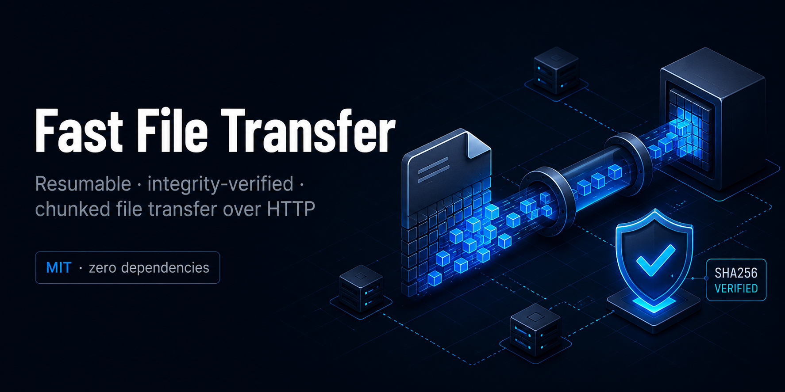

<p align="center">
  
</p>

# Fast File Transfer (`fft`)

Resumable, integrity-verified large-file transfer over plain HTTP — chunked,
sha256-checked end to end, with a pluggable auth model. **Zero runtime
dependencies** (Node standard library only).

- **Chunked** — files are uploaded in fixed-size pieces written straight to disk
  at their byte offset. Memory stays flat regardless of file size (tested into
  the multi-GB range).
- **Resumable** — interrupted uploads *and* downloads pick up exactly where they
  stopped, using byte-range bookkeeping and HTTP `Range`.
- **Verified** — every transfer is checked against its sha256 on commit and again
  on download. A corrupted or truncated transfer fails loud, never silently.
- **Atomic** — a file only becomes downloadable after the full content is hashed
  and matches; partial uploads are never served.
- **Pluggable auth** — ships with bearer-token auth; swap in your own scheme
  (JWT, mTLS, signed envelopes) by implementing one function.

## How it works

```
client                          server
  │  POST /v1/uploads           ── declare {name, size, sha256}
  │  ◄─ uploadId + uploadSecret
  │  PATCH /v1/uploads/:id?offset=N  ── stream each chunk (resumable, any order)
  │  POST /v1/uploads/:id/commit     ── server re-hashes, verifies, atomically publishes
  │  GET  /v1/files/:id              ── stream download (Range-resumable, sha256-verified)
```

## Install

```bash
npm install            # or: bun install / pnpm install
npm run build          # compiles TypeScript to dist/
```

Requires Node.js ≥ 20.

## Quickstart

**1. Run a server**

```bash
cp .env.example .env
# edit .env: set a strong FFT_TOKEN
npm run serve          # or: node dist/cli.js serve
# fft server listening on 0.0.0.0:8787
```

**2. Send a file**

```bash
node dist/cli.js send ./bigfile.zip --to http://your-server:8787 --token "$FFT_TOKEN"
# send: 100% (512.0MB/512.0MB)
# done: bigfile.zip (512.0MB)  id=3f1c…  sha256=…
```

**3. Receive it**

```bash
node dist/cli.js recv 3f1c… --from http://your-server:8787 --token "$FFT_TOKEN" --out ./bigfile.zip
# recv: 100% (512.0MB/512.0MB)
# saved: bigfile.zip (512.0MB)
```

(During development you can run the CLI without building: `npx tsx src/cli.ts ...`.)

**Deploying to a server?** See **[docs/DEPLOY.md](docs/DEPLOY.md)** — a production-ready
VPS setup with a systemd service, HTTPS reverse proxy (Caddy or nginx), firewall, and a
security checklist.

## Configuration

The server reads these environment variables (see `.env.example`):

| Variable | Default | Meaning |
|---|---|---|
| `FFT_TOKEN` | _(empty)_ | Bearer token clients must present. **Empty disables auth — dev only.** |
| `FFT_HOST` | `0.0.0.0` | Listen address |
| `FFT_PORT` | `8787` | Listen port |
| `FFT_STORAGE_DIR` | `./fft-data` | Where files + in-progress chunks live |
| `FFT_MAX_FILE_BYTES` | `21474836480` (20 GiB) | Reject larger files at init |
| `FFT_CHUNK_BYTES` | `8388608` (8 MiB) | Default chunk size |
| `FFT_QUOTA_BYTES` | `-1` | Total storage per principal; `-1` = unlimited |
| `FFT_RETENTION_DAYS` | `30` | Auto-expire completed files; `0` = keep forever |
| `FFT_DISK_MARGIN_BYTES` | `536870912` (512 MiB) | Refuse uploads that would breach this free-disk floor |
| `FFT_SESSION_IDLE_MINUTES` | `60` | Abandon idle in-progress uploads (frees their reservation) |

## Library usage

```ts
import { startServer, upload, download, loadConfig } from "fast-file-transfer";

// Server
await startServer({ config: loadConfig() });

// Upload
const { id, sha256 } = await upload({
  server: "http://host:8787",
  token: process.env.FFT_TOKEN,
  file: "./report.pdf",
  onProgress: (done, total) => console.log(`${done}/${total}`),
});

// Download (verifies sha256, resumes if a partial file exists)
await download({ server: "http://host:8787", token: process.env.FFT_TOKEN, id, dest: "./report.pdf" });
```

### Custom authentication

The server depends only on an `Authenticator` — `(req) => Principal | null`:

```ts
import { createServer, loadConfig } from "fast-file-transfer";

const server = createServer({
  config: loadConfig(),
  authenticate: (req) => {
    const user = verifyMyJwt(req.headers["authorization"]);
    return user ? { id: user.id } : null; // id scopes per-user quota
  },
});
server.listen(8787);
```

## HTTP API

| Method & path | Purpose |
|---|---|
| `GET /healthz` | Liveness check (no auth) |
| `POST /v1/uploads` | Init: `{name, size, sha256, chunkSize?}` → `{uploadId, uploadSecret, chunkSize}` |
| `PATCH /v1/uploads/:id?offset=N` | Upload one chunk (raw body, header `X-Upload-Secret`) |
| `GET /v1/uploads/:id` | Upload status / resume info (header `X-Upload-Secret`) |
| `POST /v1/uploads/:id/commit` | Verify + atomically publish (header `X-Upload-Secret`) |
| `GET /v1/files/:id` | Download (supports `Range`) |
| `GET /v1/files/:id/meta` | File metadata |

All routes except `/healthz` require the configured auth. Write operations on an
upload additionally require the per-upload `uploadSecret` returned by init.

See [`DESIGN.md`](./DESIGN.md) for the protocol, integrity, and security model.

## Federation mode

Federation mode lets agents send files **to each other by agent ID** through a
shared relay gateway, with a **consent-gate**: the recipient must explicitly
accept before any bytes are delivered.

```
agent-a  →  POST /v1/transfers (to=agent-b)  →  gateway
            PATCH /v1/uploads/:id  (chunks)
            POST  /v1/uploads/:id/commit

agent-b  →  GET  /v1/transfers/incoming       →  gateway  (metadata only)
         →  POST /v1/transfers/:id/accept     →  gateway
         →  GET  /v1/transfers/:id/content    →  gateway  (bytes, sha256-verified)
```

### Quickstart (A → gateway → B)

**1. Start a gateway**

```bash
FFT_TOKEN=relay-token node dist/cli.js serve
```

The standard `fft serve` command runs in both direct and federation mode
simultaneously — the federation routes live under `/v1/agents` and
`/v1/transfers` on the same port.

**2. Register both agents**

```bash
# agent-a
node dist/cli.js federation register \
  --gateway https://gateway.example.com --agent agent-a --token relay-token

# agent-b (on another machine)
node dist/cli.js federation register \
  --gateway https://gateway.example.com --agent agent-b --token relay-token
```

**3. agent-a sends a file**

```bash
node dist/cli.js federation send ./report.pdf \
  --to agent-b \
  --gateway https://gateway.example.com --agent agent-a --token relay-token
# prints: <transferId>
```

**4. agent-b lists incoming, accepts, and downloads**

```bash
# List pending transfers (metadata only — no bytes yet).
node dist/cli.js federation recv \
  --gateway https://gateway.example.com --agent agent-b --token relay-token

# Accept (consent-gate).
node dist/cli.js federation accept <transferId> \
  --gateway https://gateway.example.com --agent agent-b --token relay-token

# Download (sha256-verified, resumable).
node dist/cli.js federation download <transferId> \
  --gateway https://gateway.example.com --agent agent-b --token relay-token \
  --out ./report.pdf
```

### Library usage

```ts
import {
  registerAgent, sendToAgent, listIncoming,
  acceptTransfer, downloadTransfer,
} from "fast-file-transfer";

const opts = { gateway: "https://gateway.example.com", agentId: "agent-a", token: "relay-token" };
await registerAgent(opts);
const { transferId } = await sendToAgent({ ...opts, file: "./data.zip", toAgentId: "agent-b" });

// On agent-b's side:
const optsB = { ...opts, agentId: "agent-b" };
const [pending] = await listIncoming(optsB);
await acceptTransfer({ ...optsB, transferId: pending.transferId });
await downloadTransfer({ ...optsB, transferId: pending.transferId, dest: "./data.zip" });
```

### Custom agent authentication

```ts
import { createFederationGateway } from "fast-file-transfer";

const server = createFederationGateway({
  config,
  authenticateAgent: (req) => {
    const claims = verifyMyJwt(req.headers["authorization"]);
    return claims ? { agentId: claims.sub } : null;
  },
});
server.listen(8787);
```

See [docs/FEDERATION.md](./docs/FEDERATION.md) for the full protocol,
consent-gate model, and security notes.

## Security notes

- **Run behind TLS.** This server speaks plain HTTP; terminate TLS at a reverse
  proxy or tunnel. Never expose it on the internet without TLS and a strong token.
- The bearer token is the server-wide credential; the per-upload `uploadSecret`
  binds chunk/commit operations to whoever initiated the upload, so one token
  holder cannot hijack another's in-flight upload.
- Filenames are reduced to a safe basename server-side; no path traversal.
- Backend APIs assume the configured auth is the trust boundary — pick a real
  token (`openssl rand -hex 32`) before going public.

## Development

```bash
npm run typecheck   # tsc --noEmit
npm test            # node --import tsx --test test/*.test.ts
npm run build       # emit dist/
```

The test suite runs 31 tests: 18 for the core engine and 13 for federation mode
(registration, addressing, consent-gate, e2e A→B, decline, download-before-accept).

## License

[MIT](./LICENSE)
